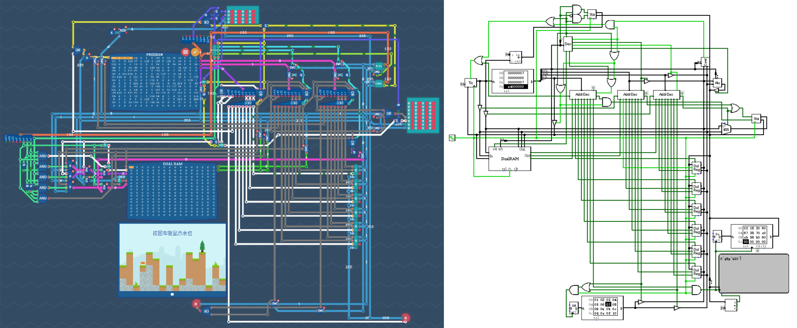

# “电脑”结构

### 图灵完备“电脑”
由于这个汇编器（其实是微处理器）是随着[图灵完备](https://store.steampowered.com/app/1444480/Turing_Complete/)游戏搭建的，所以搭建的整体思路是在规定的架构之上添加规定的功能。游戏中规定的架构为哈佛式、指令为`32bit`指令（格式为`Opcode in1 in2 out`，`WORD=8bit`），其中有一个可编写的`ROM`为程序，微处理器内部有多个寄存器，输入和输出总线均为`8bit`，内部ALU可计算`+`、`-`、`AND`、`OR`、`XOR`、`>>`、`<<`、`NOT`。其中要求实现的功能为规则跳转（分支语句）、推栈（变量推栈与函数推栈）、接入内部RAM。

根据这些要求，我扩展了原本的指令集、以实现不同上述功能，具体格式如下：
|立即数(`2bit`)|模式(`3bits`)|具体行为(`3bits`)|
|:--:|:--:|:---:|
|bit 7: 立即数1 bit 6: 立即数2|bits 5-3|bits 2-0|
> **注意**：采用大端序，bit7为最高有效位

<table>
  <thead>
    <tr><th colspan="4" style="text-align: center;">
        <strong>OPcode 模式与动作编码表</strong></th>
    </tr>
    <tr>
      <th style="text-align: center;">模式编码</th>
      <th style="text-align: center;">模式名称</th>
      <th style="text-align: center;">动作编码</th>
      <th style="text-align: center;">动作描述</th>
    </tr>
  </thead>
  <tbody style="text-align: center;">
    <tr>
      <td rowspan="8"><code>0x00</code> <code>0x10</code></td>
      <td rowspan="8"><strong>Calc</strong> 算术运算</td>
    <td><code>0x0</code></td><td><code>+</code>(加法)</td></tr>
    <tr><td><code>0x1</code></td><td><code>-</code>(减法)</td></tr>
    <tr><td><code>0x2</code></td><td><code>AND</code>(与运算)</td></tr>
    <tr><td><code>0x3</code></td><td><code>OR</code>(或运算)</td></tr>
    <tr><td><code>0x4</code></td><td><code>NOT</code>(非运算)</td></tr>
    <tr><td><code>0x5</code></td><td><code>XOR</code>(异或运算)</td></tr>
    <tr><td><code>0x6</code></td><td><code>&lt;&lt;</code>(左移)</td></tr>
    <tr><td><code>0x7</code></td><td><code>&gt;&gt;</code>(右移)</td></tr>
    <tr>
      <td rowspan="6"><code>0x08</code></td>
      <td rowspan="6"><strong>RAM</strong> 内存访问</td>
    <td><code>0x0</code></td><td>读<code>Operand1</code>&<code>Operand2</code></td></tr>
    <tr><td><code>0x1</code></td><td>读 (非单tic)</td></tr>
    <tr><td><code>0x2</code></td><td>读、写</td></tr>
    <tr><td><code>0x3</code></td><td>写 (非单tic)</td></tr>
    <tr><td><code>0x4</code></td><td>读 (单tic)</td></tr>
    <tr><td><code>0x7</code></td><td>写 (单tic)</td></tr>
    <tr>
      <td rowspan="6"><code>0x20</code></td>
      <td rowspan="6"><strong>If/JUMP</strong> 条件跳转/比较</td>
    <td><code>0x0</code></td><td><code>=</code>(等于)</td></tr>
    <tr><td><code>0x1</code></td><td><code>≠</code>(不等于)</td></tr>
    <tr><td><code>0x2</code></td><td><code>&lt;</code>(小于)</td></tr>
    <tr><td><code>0x3</code></td><td><code>≤</code>(小于等于)</td></tr>
    <tr><td><code>0x4</code></td><td><code>&gt;</code>(大于)</td></tr>
    <tr><td><code>0x5</code></td><td><code>≥</code>(大于等于)</td></tr>
    <tr><td><code>0x30</code></td><td><strong>call</strong> 函数调用</td>
      <td colspan="2" style="text-align: center;"><code>PC</code>（代码位置）压栈</td></tr>
    <tr><td><code>0x38</code></td><td><strong>ret</strong> 函数返回</td>
      <td colspan="2" style="text-align: center;"><code>PC</code>（代码位置）弹栈</td></tr>
  </tbody>
</table>

> 注：所有动作编码均按升序排列，RAM模式中单tic标志位于bit3(0x4)

### [logisim](https://cburch.com/logisim/)电路
[logisim](https://cburch.com/logisim/)中的元件与图灵完备中提供的并不相同，如logisim中没有`dualReg`、`dualRAM`、`stack`。为了最大程度复刻但不添加过多新元器件，我决定微调`dualRAM`，并与`dualReg`、`stack`使用`regester`与`RAM`实现，具体实现方式如下：
|名称|实现逻辑|结构|
|:--:|:-----:|:--:|
|dualReg|在基础寄存器上添加输出控制线缆|![Out[i] = Ctrl[i] * Data(Q)](./resource/dualReg.png)|
|stack|使用一个寄存器记录栈顶，使用一个`RAM`存储数据 栈无数据时输出`0xFF`|![stack[top++] = in, out = stack[--top]](./resource/stack.png)|
|dualRAM|对于非单tic读取，使用异步加载：在设置tic使用一个寄存器存储第一个读取的值（若有），另一个寄存器存储第二个读/写地址；在读取tic输出一个寄存器存储的值（若有），同时读/写第二个地址 对于单tic读取，`in1`为地址，`out3`、`in2`分别作为数据读、写|![out1reg = RAM[in1], sto = in1 or in2; out1 and out2 = out1reg or RAM[sto](, out3 = RAM[in1])](./resource/dualRAM.png)|

有了上述的自定义原件，便可以复刻图灵完备中的“电脑”，其中主要架构与图灵完备中完全一致。

由于[logisim](https://cburch.com/logisim/)中没有真正意义上的输入输出，所以目前是使用一个`ROM`模拟输入，一个`RAM`记录输出，一个`TTY`显示可打印字符（`ASICC≥32`）。

