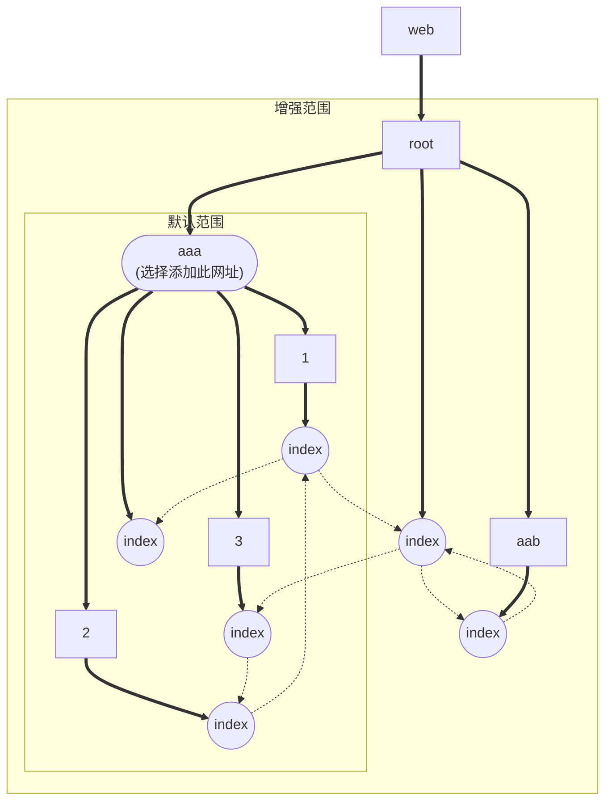
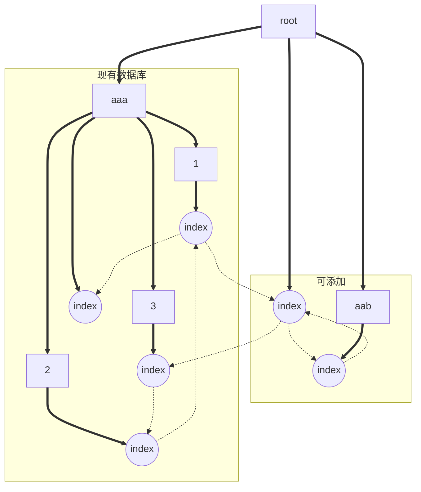
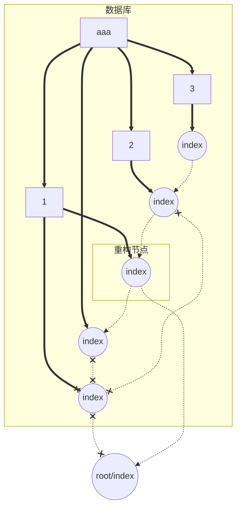

# 主要功能

我们根据目标生成了许多功能，包括但不限于：
- 添加网站
- 定期扫描并修复
- 修复失效网络链条

## 添加网站

当用户选择任意一个网站添加备份时，系统会读取该网站页面，获取所有该网站的链接并存储所有的父子关系，然后使用广度优先搜索所有该网站所链接的网页并加入数据库。用户可以选择是否添加其所链接其他域名进入数据库，以及此域名下的获取范围。

## 定期扫描并修复

用户在部署此系统后，可以设定自动扫描周期以及扫描范围，系统会自动获取网页状态码并更新数据库超链接与网页快照，用户可以选择是否新增网页以完善现有数据库网络。当数据库中网页缺失时，系统将自动执行修复命令并更新网页快照。

## 修复失效网络链条

对于失效网站，系统会自动获取其有效父网站，并根据标题信息与网页信息相似度重构网站链接。若网站被找到，旧网站将被链接至新网站；否则，旧网站将被标记为“废弃”。

若出现网站架构迁移，则会根据修复结果智能验证性迁移相似失效网站。

