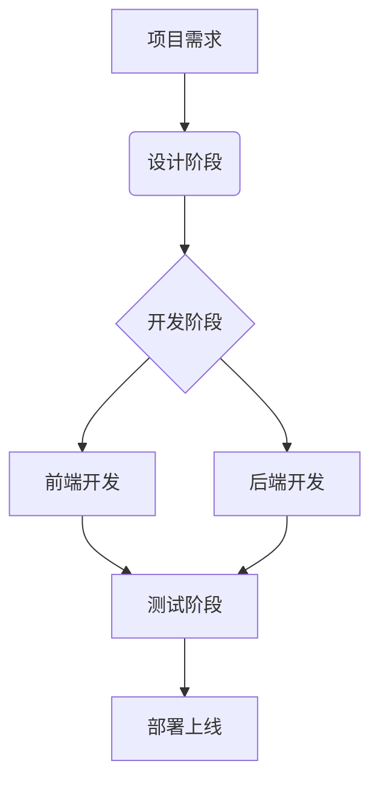

# 项目介绍

67-99项目是一个创新的多栏布局页面设计，旨在提供直观的内容导航和清晰的信息架构。本项目结合了现代Web技术和用户体验设计原则，创造出一个功能丰富且视觉吸引的界面。

## 项目背景

随着信息量的不断增加，传统单栏页面布局已无法满足用户对内容组织和快速访问的需求。67-99项目应运而生，通过多栏布局和智能导航系统，提升了信息获取效率。

```mermaid
graph TD
    A[项目需求] --> B(设计阶段)
    B --> C{开发阶段}
    C --> D[前端开发]
    C --> E[后端开发]
    D --> F[测试阶段]
    E --> F
    F --> G[部署上线]
```