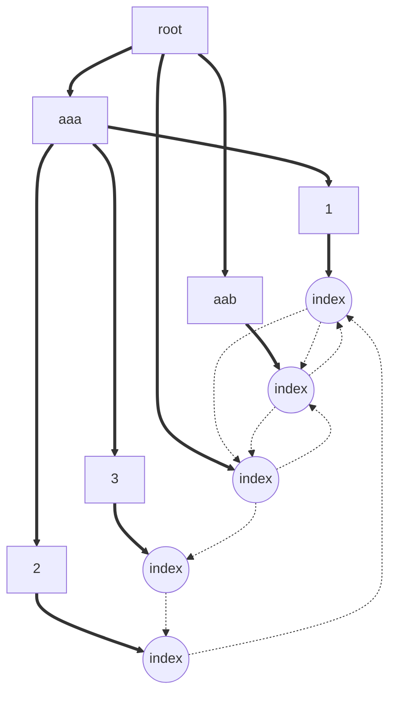

# 技术架构

我们考虑到现实中用户不同的需求，设计出两种不同的数据库结构，并且留有可拓展接口。对于现有功能，目前使用python快速实现，未来可以使用java重构此项目。

## 网站数据库关联设计

对于数据库结构的设计，我们想模仿网站结构存储，也就是以树形结构为基础搭建数据库。在此基础上，我们创造性的提出父/子指针，来构建网页间的超链接结构。通过超链接指针，我们可以根据超链接描述恢复移位网站。



## 数据库搭建

我们的网页数据库是以树状网络为基础、以单向图为架构的数据库，所以用户可以根据数据量来进行选择：小数据量存储在树状文件系统中、大数据量存储在sql等数据库中

### 树状文件系统存储

在树状系统中，我们以文件夹架构构建网络架构，同级域名间在同一个文件夹中（父域名相同）。网站的每个网页为一个文件夹，文件夹内包含多个网页快照（以日期存储）和一个json文件，里面包含了这个网页相关的超链接信息。
```
dataset/
└── branch/
    ├── aaa/
    │   ├── 1/
    │   │   └── index/
    │   │       ├── 20250920.html
    │   │       └── info.json
    │   ├── 2/
    │   │   └── index/
    │   │       ├── 20250920.html
    │   │       └── info.json
    │   └── 3/
    │       └── index/
    │           ├── 20250920.html
    │           └── info.json
    ├── aab/
    │   └── index/
    │       ├── 20250920.html
    │       └── info.json
    ├── b/
    │   └── index/
    │       └── info.json
    └── index/
        ├── 20250920.html
        └── info.json
```

超链接由其父列表与子列表组成，每一个元素由<code>描述信息</code>与<code>连接</code>组成，父列表表示指向它的所有网址，子列表表示它指向的所有网址。

```
info.json:
{
    preList:[
        {父url1: 父描述1},
        {父url2: 父描述2},
        ...
    ],
    postList:[
        {子url1: 子描述1},
        {子url2: 子描述2},
        ...
    ]
}
```

### 数据库存储

在以表为基础的数据库中，我们以表构建树状网络架构。网站的每个网页为一个单独的表，表内包含多个网页快照（以日期存储）和一个json文件，里面包含了这个网页相关的超链接信息。


超链接由其父列表组成，每一个元素由<code>描述信息</code>与<code>父节点ID</code>组成，父列表表示指向它的所有网址。

```
info.json:
{
    preList:[
        {父urlID1: 父描述1},
        {父urlID2: 父描述2},
        ...
    ]
}
```