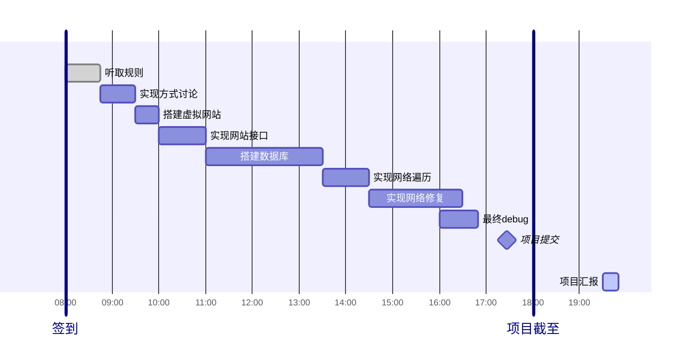

# 项目时间线

由于黑客松在一天内举行（2025/9/20），所以每一项功能开发的耗时都被压缩到了极致。

```mermaid
gantt
    dateFormat HH:mm
    axisFormat %H:%M
    签到: vert, v1, 08:00, 1m
    听取规则: done, 08:00, 45m
    实现方式讨论: 45m
    搭建虚拟网站: 30m
    实现网站接口: 1h
    搭建数据库: 2.5h
    实现网络遍历: 1h
    实现网络修复: 2h
    最终debug: 16:00, 16:50
    项目提交: milestone, m2, 17:27, 
    项目截至: vert, v1, 18:00, 1m
    项目汇报: active, 19:30, 20m
```