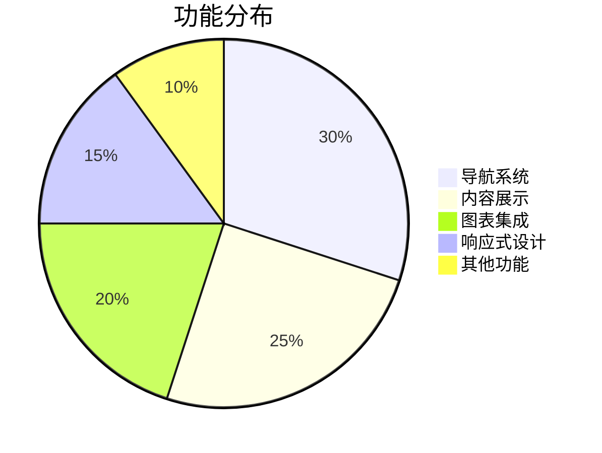

# 工作流程

67-99项目遵循标准的产品开发流程，确保高质量交付。


```mermaid
pie title 功能分布
    "导航系统" : 30
    "内容展示" : 25
    "图表集成" : 20
    "响应式设计" : 15
    "其他功能" : 10
```

```mermaid
graph LR
    A[需求分析] --> B[设计原型]
    B --> C[技术选型]
    C --> D[开发实现]
    D --> E[测试验证]
    E --> F[部署上线]
    F --> G[用户反馈]
    G --> A