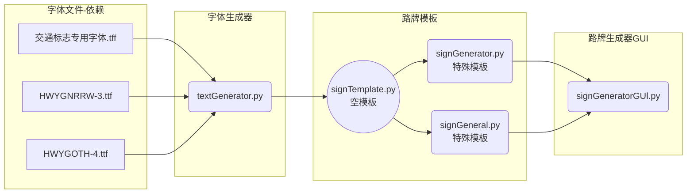
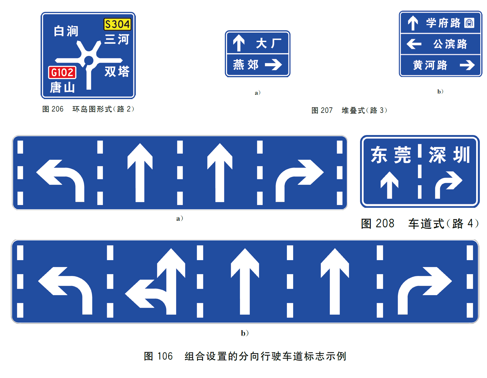

# 程序设计

整个程序由3部分组成：字体生成器、路标模板、路牌生成器GUI。其中路牌的生成使用`PIL`、`cv2`库制作，GUI由`PyQt`制作。

## 字体生成器

根据[国标](https://openstd.samr.gov.cn/bzgk/gb/std_list?p.p1=0&p.p90=circulation_date&p.p91=desc&p.p2=5768.2)中关于字体的规定：

- 交通标志字体分为A型、B型和C型三种，具体参数如下

|类型|参数|用途|
|:---:|:---:|:---:|
|A|宽高比：1 字体宽：$\frac{1}{10}$ h|一般情况|
|B|宽高比：0.65 字体宽：$\frac{1}{6}$ h|公路命名编号标志 公路编号标志 出口编号标志 里程牌和百米牌中的字母和阿拉伯数字|
|C|宽高比：0.5 字体宽：$\frac{1}{10}$ h|指路标志箭杆上的公路编号的字母和阿拉伯数字|

- 阿拉伯数字高度应为汉字高度的$\frac{1}{3}$~$\frac{1}{2}$
- 小数点后的阿拉伯数字高度宜为汉字高度的$\frac{1}{2}$~$\frac{2}{3}$

由于并没有找到全部国标字体，所以目前使用`交通标志专用字体.tff`、`HWYGNRRW-3.ttf`和`HWYGOTH-4.ttf`来模拟国标字体，并使用`cv2`变换距离来调整字体粗细。

## 路标模板
路标模板以国标中内容为主，根据使用场景分为一般道路、高速公路和小型标牌三类，但因为编写进度缓慢，所以后加入了通用标牌以满足自定义需求

### 一般道路
一般道路中分为预告路牌与车道路牌两类，目前实现了预告路牌中的环岛式、堆叠式与车道路牌的车道指示和车道预告，[国标](https://openstd.samr.gov.cn/bzgk/gb/std_list?p.p1=0&p.p90=circulation_date&p.p91=desc&p.p2=5768.2)内示意如下：

其中，对于环岛式等平交路口预告路牌开发了带柄绘制模块（见下），它可以根据文字内容所占据的空间，自动生成一个指向文字内容的柄，以实现不同方向的预告指引自动化。