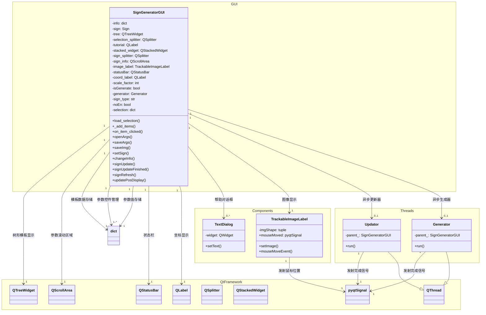

### 高速公路

目前高速公路已实现入口预告以及出口方向，但由于实现的比较早（在系统改模板函数之前），所以可能会有一些小bug。这两种路牌作用如下：
- 入口预告：设置于一般道路进入高速的位置。指示入口方向以及距离，同时告知对应高速以及地点方向；
- 出口方向：设置于高速前往其他方向时。可指示匝道类型/形状，以及匝道对应高速以及地点方向。

### 小型标牌

除了常见的各种大型标牌，还有道路编号、出口编号等辅助标牌，它们虽然在模板路牌中有函数实现；但为了方便，这里均重新实现了一遍。设计思路如下：
- 道路编号：所有字符距边界均为0.1h，若高速编号数字个数大于4，从第3位起为下标；
- 出口编号：编号的外框与椭圆相切，编号中英文字母为下标；
- 辅助标牌：纯文本，可以通过`\n`换行。

### 通用标牌

这个标牌可以调用路牌模板内函数以绘制所有符号，支持更改大小。可绘制内容如下：
- 文字：可选文字内容、文字类型（A/B/C）、文字大小等；
- 圆角矩形：可选颜色、半径、大小等；
- 直箭头：绘制八方向箭头和左右转、掉头，可改变箭头大小、线宽等；
- 曲箭头：绘制左右弯、立交桥左，可改变箭头大小、线宽等；
- 柄：绘制任意方向直线、左右弯，可改变线宽等。

## 路牌生成器GUI

整个GUI由`PyQt`编写，分为左、中、右三个操作区，分别为：模板区、参数区、生成区。
- 模板区：模板区会根据可用模板进行加载，并将可用模板以树的形式显示。点击对应项目即可加载模板；
- 参数区：参数区会实时显示目前路牌的可用参数，通过更改参数，生成区即可生成对应路牌；
- 生成区：生成区显示当前参数对应的路牌，若路牌正在绘制，则会在原来路牌上写上“生成中”。<del>之前尝试使用旋转加载图片，但失败了</del>

程序允许用户保存与加载路牌，信息以`json`文件的形式存储。当有路牌在生成区中生成时，用户可以保存原始路牌文件（10倍扩展的png图片）。

由于路牌生成比较费时（有多个cv2操作，且会单字单子书写），为了不阻塞线程，生成在QThread中进行，并用槽函数链接传递信息。