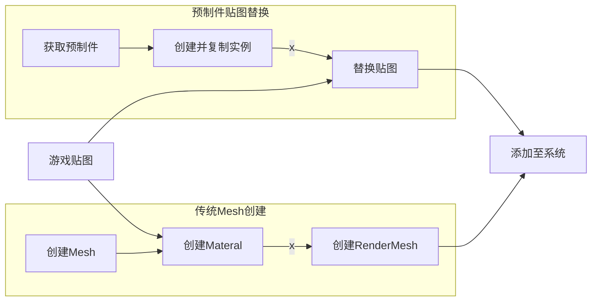
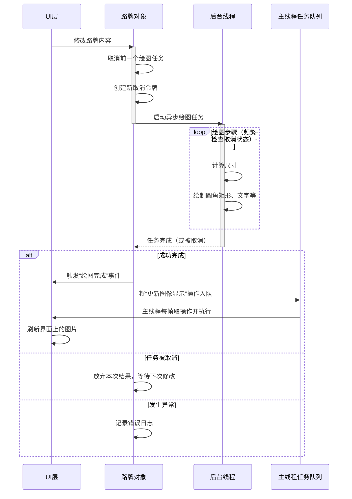

# 模组开发
## 整体预览
目前模组已可以在游戏UI中显示，正在开发资产导入系统（GameObject方案）。

## 开发过程
作为一个没有学过的语言，同时面对的是一个工作室的游戏项目，并且我没找到很有效的官方文档，整个开发过程无比的艰难。

### 比较顺利的UI显示
在天际线Debug包`npm`构建完成时，我对整体的架构并没有什么掌握。看着最一开始的`Mod.cs`和`SignGenerator-UI`包，我决定先把顶层的UI做一做试试。

天际线UI是基于`TS`、`CSS`的浏览器（应该是Unity生成的浏览器），所以整体模式与网页前端类似。天际线在基本组件的基础上提供了一个`ui.d.ts`以更方便地编写一些交互组件，如`Button`、`TipBox`等。所以模组UI编写只需要更改`index.tsx`（UI入口）并添加相关样式即可。

第一个难题是如何将写出的窗口挂载到游戏中。在仅有的官方[Wiki](https://cs2.paradoxwikis.com/UI_Modding#cs2/api)中，提供了4个挂载点：`Menu`、`Game`、`GameTopLeft`和`GameTopRight`，分别对应主菜单、游戏界面、游戏左上角、游戏右上角。当我试图将按钮挂载到左上角时，按钮成功地显示在了其他按钮后面；而当我通过挂载到游戏界面中，试图显示一个窗口panel时，它却怎么也显示不出来。通过代码输出所有[挂载点](.)后，我依旧找不到能挂载到界面右侧的那个挂载点。最后我研究了现有的的模组[RoadBuilder](https://github.com/JadHajjar/RoadBuilder-CSII)的UI挂载，才发现其实是通过`Game`挂载点和`CSS`样式实现的。

第二个难题是UI与C#端交互。这个模组的本质是用C#生成内容，然后在游戏中显示，所以会涉及图片和C#中的类的显示。对于图片，UI可以通过``显示图像`base64`字符串，所以可以编码后显示字符串。而对于C#结构体/类的显示就要根据C#-TS交互原理设计了。两侧交互的底层原理是序列化为json后传递，所以对于简单类型如`Vector3`可以在TSX中用`interface`表示并绑定类型，复杂类型可以通过传递json后再拆开（如天际线使用`Colossal.Json.JSON`）。

*最麻烦的是代码测试，由于天际线的体量很大，若我通过VS把程序绑在游戏上，游戏就会卡住，于是只能先构建，再启动游戏，每次进存档都要花上1分钟，所以最后就是来来回回地打开、关上游戏……*

### 无比曲折的ECS系统研究
对于模型创建，最一开始想的是将贴图生成后创建Mesh模型，绘制贴图，再将模型通过API绑定在游戏中。等到真正写代码的时候才发现怎么找也找不到其中一个关键的组件——`RenderMesh`。根据官方dll提供的API，没有类名为`RenderMesh`，也就是组装为Mesh后无法设置Mesh渲染结构并添加到天际线原生系统中。

经查询，由于天际线2使用重构的ECS渲染架构，很多渲染流程和传统的渲染结构不同，所以我开始通过复制、组合并更改预制件的贴图来创建新资产。最一开始还比较顺利，通过`PrefabSystem`找到了广告牌预制件`BillboardWallSmall01`，然后根据预制件创造并复制实体。接下来最关键的一步卡住了：如何获取并替换贴图。天际线的实体结构比较特殊，它通过在`m_SubMesh`中记录该存档（打开的游戏）所有对应实例，而每个的`m_Mesh`记录白模，但这个Mesh没有记录贴图，而是通过一个单独的渲染系统记录，所以从这里替换贴图的方案就被毙掉了。



> 事后看来，应该是天际线2不想像天际线1一样，一更新就大量模组报错，所以限制了模组API和资产创建方式，其中资产创建只能通过资产编辑器添加。所以给反过来想将资产添加进天际线ECS系统大概率是不可能了，同时也是无法将创建的资产与游戏文件保存在一起。

### GameObject方案探索
GameObject本质上是Unity的默认架构，只要使用Unity应该都可以用这种方法构建。它唯一的问题就是无法同存档保存，只能单独在一个地方保存，和[WriteEverywhere](https://github.com/klyte45/CS2-WriteEverywhere/tree/master/BelzontWE)一样。

`GameObject`由`Mesh`、`Material`、`Transform`三部分组成，分别是模型网格、模型贴图、和模型位置。`Mesh`的生成和之前一样，只要构建所有三角形，创建基向量即可。`Material`由贴图`Texture2D`和渲染器`Shader`两部分组成，其中`Texture2D`是由路牌生成器生成的图片转换而来，而`Shader`需要从游戏中的Shader系统中选一个合适的生成器。由于我前期以实现为重，所以选择了平面渲染器`HDRP/Unlit`或`HDRP/Lit`。

最后的`Transform`部分由位置position和角度angle组成，其中位置需要根据游戏系统获取真实位置。在不断的寻找中，我发现游戏的ECS系统中有一个`RaycastSystem`系统，它接受一个`RaycastInput`作为请求，在若干帧后返回一个`RaycastResult`作为结果。根据这个系统我们就可以构造一个向游戏中的点击请求，通过摄像头的角度获取点击的位置。结合这三部分，模型就可以正常显示了。

```
/// <summary>
/// 提交鼠标点击的世界坐标获取任务
/// </summary>
private void GetMousePosition()
{
    Camera cam = Camera.main;  // 获取主摄像机
    Ray ray = cam.ScreenPointToRay(_InputManager.mousePosition);  // 创建从摄像机发射的射线，经过鼠标位置
    // 构建线段（起点和终点）
    float3 start = new(ray.origin.x, ray.origin.y, ray.origin.z);
    float3 end = start + new float3(ray.direction.x, ray.direction.y, ray.direction.z) * 20000f;
    var segment = new Colossal.Mathematics.Line3.Segment(start, end);
    // 创建 RaycastInput
    var input = new RaycastInput
    {
        m_Line = segment,
        m_Offset = float3.zero,
        m_Owner = Entity.Null,
        m_TypeMask = TypeMask.Terrain,
        m_CollisionMask = CollisionMask.OnGround | CollisionMask.Overground,
        m_NetLayerMask = Game.Net.Layer.All,
        m_AreaTypeMask = AreaTypeMask.None | AreaTypeMask.Lots | AreaTypeMask.Districts | AreaTypeMask.MapTiles | AreaTypeMask.Spaces | AreaTypeMask.Surfaces,             // 检测所有区域类型
        m_RouteType = Game.Routes.RouteType.None,
        m_TransportType = TransportType.None,
        m_IconLayerMask = Game.Notifications.IconLayerMask.None,
        m_UtilityTypeMask = Game.Net.UtilityTypes.None,
        m_Flags = 0
    };
    _raycastContext = new object();
    _raycastSystem.AddInput(_raycastContext, input);
    _waitingPosResult = true;
}
```

> 其中`_raycastSystem.GetResult(_raycastContext)?.[0].m_Hit.m_Position`就是获取的鼠标按键位置

### 路牌存储结构设计

在Python中，我采用了一个非常灵活的动态存储方式：即每个路牌实例内部维护一个info字典，而键值对直接对应UI上的参数（例如`{"num": 3, "direction1": {"heading": 0, "text": "机场", "textEn": "Airport"}}`）。得益于Python的鸭子类型和json模块的天然支持，新增一种样式只需往字典里塞新字段，解析时按需读取即可。这种“字典即模式”的做法让不同路牌的设计极为方便——即通过info读取所需信息并绘制。

然而，当我把这套设计移植到天际线的C#模组时，问题接踵而至：
- 强类型约束：C#的序列化（`Colossal.Json`）要求类型明确，字典套字典的方式虽然能工作，但反序列化后只能得到`Dictionary<string, object>`，访问深层属性时既繁琐又不安全，并且对于每个属性都需要进行强转才能获取数据。
- UI的双向绑定：模组UI是基于TS的，需要根据类型来显示编辑框。动态字典无法提供稳定的类型，导致前端显示困难。
- 嵌套结构表达：路牌样式本质上是树状结构（例如环岛形的数据本质上是一个带柄绘制模块的列表）。Python中可以用字典嵌套列表再嵌套字典来模拟，但C#里这样就又回到了强类型与弱类型的区别，无法通过转换这个`info`来安全、稳定地得到嵌套结构的类型。

于是，我彻底重构了存储模型。通过借鉴`Qt`中的`QObject`树思想，简化并设计了`SignWidget`抽象基类（虽然应该写成`interface`，但这样对绘画不友好，就放成了`class`），派生出 `SignText`、`SignVBox`、`SignTripleRoundedRectangle`等具体类型。每个节点负责计算自身尺寸、绘制自身内容，并支持添加子节点。序列化时，利用`@type`字段记录实际类型，反序列化时根据类型名动态创建实例（幸亏`Colossal.Json`有这个功能，否则我用`switch`得写死我 (；´д｀)）。

> 回过头看，两种方案各有千秋：Python版本赢在快速实现（并且快速烂尾 (´-ω-`)），C#版本胜在健壮与可维护（这种大项目其实本来就应该用这种结构）。

### 高耗时绘图任务

由于不能使用除游戏给出的dll以外的库，所以所有绘图任务使用原生的`System.Drawing`绘制。这个库功能是挺全的，但性能就有点感人了。更“雪上加霜”的是，为了保证文字笔画和圆角边界的精度，我又需要扩大倍数绘制以增加精度，所以导致绘制时间极长（正常大小内容约10秒）。所以，异步线程+可取消任务就成了唯一的出路（又是喜闻乐见的异步φ(゜▽゜*)♪）。

在C#中，使用`System.Threading.Tasks.Task`中的`Task.Run`可以实现异步执行，同时使用`Action<>`链接绘图完成后的更新部分。若要中断正在进行的异步任务，可以使用`System.Threading.CancellationTokenSource`中的`CancellationTokenSource`来中断异步线程。

如果用在绘图中，就是在每个路牌对象开始绘图前，会先取消掉前一个尚未完成的绘图任务（如果存在），并创建一个新的“取消令牌”。然后启动一个后台线程，真正耗时的绘制工作全部在这个线程里完成。而在绘制过程中，会频繁检查“取消令牌”是否被触发。一旦发现任务已被取消（例如用户又修改了路牌内容），就立刻终止执行，避免浪费CPU去绘制一个即将被覆盖的图像。

当后台绘图成功跑完后，会触发一个“绘图完成”事件，告诉UI可以更新界面了。但是，图片对象不能在非UI线程里直接交给界面显示（会导致冲突）。因此UI层准备了一个主线程任务队列：在事件回调中，只把“更新图像显示”这个操作放入队列；然后主线程每帧检查队列，取出操作并安全地刷新界面。

这种“异步绘制+主线程同步更新”的模型，既保证了界面不会卡死，又允许用户在生成过程中随时切换面板、修改样式。

