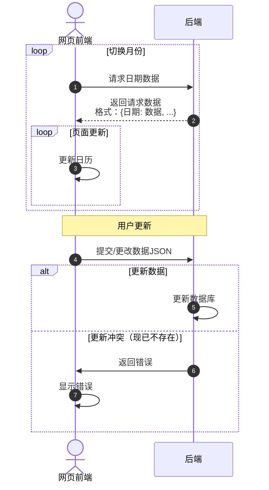

# 程序设计
### 网络环境检测
由于没有域名，所以必须要有🪜才能访问后端，所以我选择通过判断是否能连接[workers.dev](https://workers.dev)来判断是否可以加载后端。判断函数如下：
```
/**
 * 检查资源是否存在（最小化数据传输）
 * @param {string} url - 要检查的资源URL
 * @param {number} timeout - 超时时间（毫秒），默认3000ms
 * @returns {Promise<boolean>} - 资源是否存在
 */
async function checkResourceExists(url, timeout = 3000){
    if(!url)
        return false;
    const controller = new AbortController();
    const timeoutId = setTimeout(() => controller.abort(), timeout);
    if(url.startsWith('http://') || url.startsWith('https://')) {
        // 外部链接：进行简化检查（避免跨域限制）
        try {
            // 对于外部资源，使用no-cors模式避免CORS限制
            // 注意：no-cors模式下无法读取响应状态
            await fetch(url, {method: 'HEAD', mode: 'no-cors', signal: controller.signal, cache: 'no-store'});
            clearTimeout(timeoutId);
            // no-cors模式下，只要请求能发出（网络可达）就认为存在
            // 注意：这无法区分404和200，但能判断网络可达性
            return true;
        } catch (error) {
            clearTimeout(timeoutId);
            if (error.name === 'AbortError') {
                console.warn(`外部资源检查超时: ${url}`);
                return false;
            }
            console.warn(`外部资源检查失败: ${url}`, error);
            return false;
        }
    }
    // 内部资源：使用HEAD方法（只获取头部，不下载内容）
    try {
        // 使用HEAD方法，只获取响应头，不下载内容主体
        const response = await fetch(url, {method: 'HEAD', signal: controller.signal, cache: 'no-store', headers: {
                                    'Cache-Control': 'no-cache, no-store, must-revalidate', 'Pragma': 'no-cache'}});
        clearTimeout(timeoutId);
        // 对于内部资源，我们可以精确判断状态码
        // 200-299: 资源存在且正常
        // 304: 资源存在且未修改（缓存有效）
        // 401/403: 资源存在但无权访问（也算存在）
        // 404: 资源不存在
        // 其他4xx/5xx: 视为不存在
        return response.ok || response.status === 304 || 
               response.status === 401 || response.status === 403;
    } catch (error) {
        clearTimeout(timeoutId);
        // 根据不同错误类型处理
        if (error.name === 'AbortError') {
            console.warn(`资源检查超时: ${url}`);
            return false; // 超时视为不可用
        }
        console.warn(`资源检查失败: ${url}`, error);
        return false;
    }
}
```
这样，根据网络通达性可以显示两种不同的页面，一个使用后端数据，另一个使用前端静态数据。

### 前后端交互
目前的前后端交互分别有：
- 查询某（些）日期的信息
- 存储某日期的信息

因此只需要写这两个的接口即可。


由于数据量不大，所以不用分表，直接查询即可（Cloudflare的D1数据库免费上限为一天读取5M条，所以数据量<1k、访问次数少就不用做优化，超出了cloudflare会拒绝掉）。
> 注：只要有前后端交互，数据都可以被捕获，从而伪造请求。所以理论上后端内容检查与身份确认是必要的。

### 前端显示更新
为了更好的显示数据情况，日历中每天的格子会根据心情指数（-100~100）显示不同的颜色，其中：
| -100 | -70 | -40 | 0 | 100 |
|:--:|:--:|:--:|:--:|:--:|
|红色|橙色|蓝色|浅灰色|绿色|

（0~100实在是没想到合适的中间色）其余数值的颜色使用RGB插值获取。

在实际页面中，会有一个卡片显示颜色转换，可以拖动滑动条来显示不同数值的映射颜色。